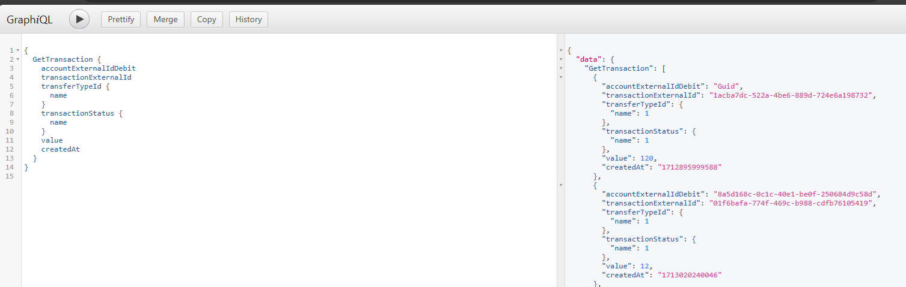
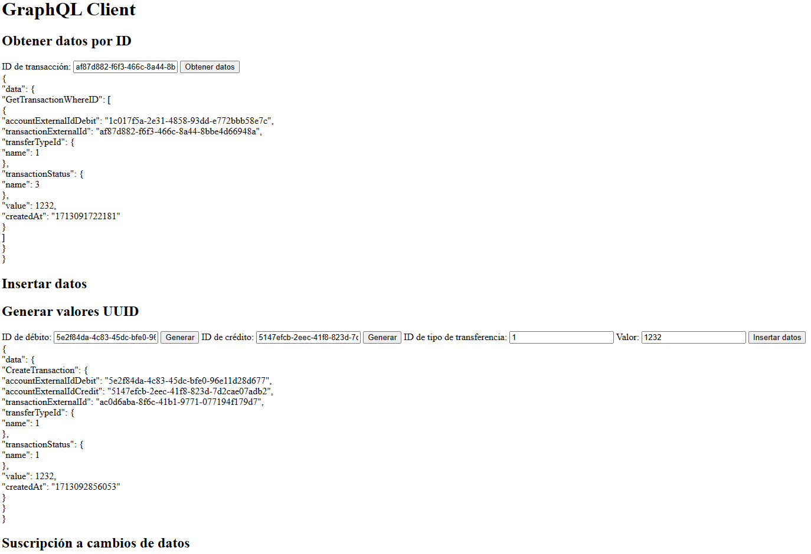

# Yape Code Challenge

## Autor

Isaac Vera Ponce
ivera.bts@gmail.com

## Descripción del Proyecto

Este proyecto es parte de un desafío de código para Yape. Implementa un servicio utilizando Node.js con Express, Graphql y Kafka.

## Tecnologías Utilizadas

- Node.js con Express
- Graphql
- Kafka

## URLs

- GraphiQL: [localhost:3333/graphql](http://localhost:3333/graphql)
- Testing Visual: [localhost:3333/](http://localhost:3333/)

## Querys Disponibles

```json
  "query": {
    "GetTransaction": {
      "transactionExternalId": true,
      "accountExternalIdDebit": true,
      "accountExternalIdCredit": true,
      "transferTypeId": {
        "name": true
      },
      "transactionStatus": {
        "name": true
      },
      "value": true,
      "status": true,
      "createdAt": true
    }
  }
```

```json
{
	"mutation": {
		"CreateTransaction": {
			"accountExternalIdDebit": "GUID",
			"accountExternalIdCredit": "GUID",
			"transferTypeId": 1,
			"value": 1,
			"transactionExternalId": true,
			"accountExternalIdDebit": true,
			"accountExternalIdCredit": true,
			"transferTypeId": {
				"name": true
			},
			"transactionStatus": {
				"name": true
			},
			"value": true,
			"status": true,
			"createdAt": true
		}
	}
}
```

```json
{
	"queryById": {
		"GetTransactionWhereID": {
			"transactionExternalId": "Guid",
			"transactionExternalId": true,
			"accountExternalIdDebit": true,
			"accountExternalIdCredit": true,
			"transferTypeId": {
				"name": true
			},
			"transactionStatus": {
				"name": true
			},
			"value": true,
			"status": true,
			"createdAt": true
		}
	}
}
```

## Captura de Pantalla del Testing




## Comandos

Para ejecutar el servicio completo con kafka utilizar:

```bash
docker-compose up --build --force-recreate -d
```
